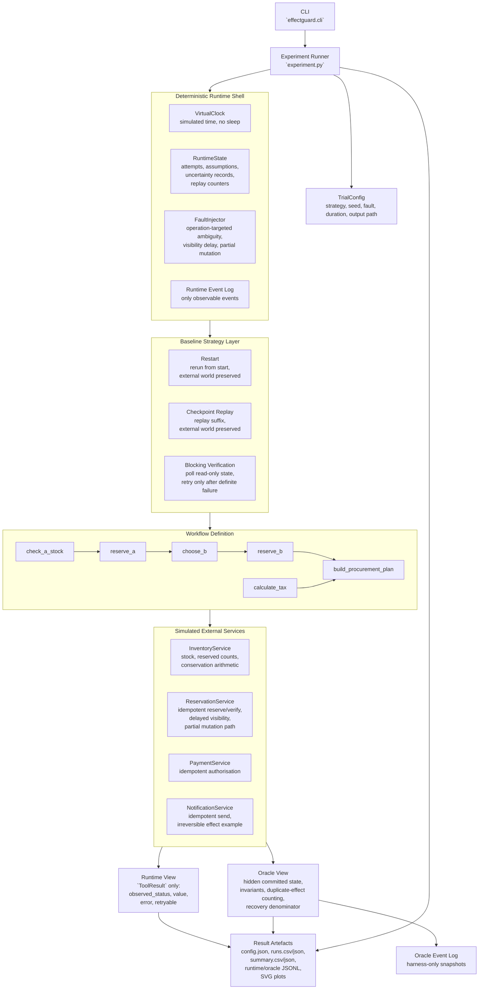
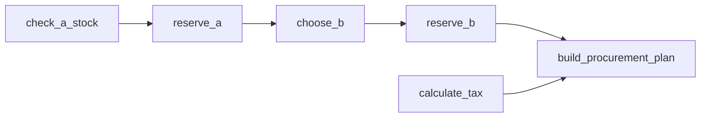

# EffectGuard

EffectGuard is an original Python research prototype for studying a specific recovery problem in workflow systems: what should a runtime do when an external mutating call may already have committed, but the caller cannot confirm that yet?

This repository implements the **P0 baseline experiment** only. It does **not** implement the future selective-recovery mechanism. That boundary is deliberate. The job of P0 is to make the failure mode visible, measurable, and reproducible before any smarter repair policy is introduced.

In plain language, the prototype simulates a situation where:

1. a mutating external call really succeeds
2. the runtime initially receives an ambiguous result such as `UNKNOWN`
3. the mutation is temporarily invisible to read-based verification
4. a coarse recovery policy assumes the operation failed
5. downstream work continues under that assumption
6. the earlier mutation later becomes visible as successful
7. the runtime discovers that its earlier assumption was wrong
8. restart-style recovery turns out not to be the same thing as rewinding external reality

That last point is the central idea behind the repository.

## Why EffectGuard Exists

In many discussions about orchestration and agent execution, restart, replay, and checkpoint restore are treated as broadly sufficient recovery tools. They are useful, but they are not magical. They can rebuild local runtime progress, yet they do not automatically undo a side effect that has already happened in an outside system.

EffectGuard exists to make that distinction concrete with a deterministic simulator:

- the runtime sees only observable tool outcomes
- the oracle sees hidden ground truth
- the simulated external services preserve committed state across restart and replay
- idempotency prevents some duplicate damage, but not all logical inconsistency
- a blocking verification baseline can avoid opening the contradictory fallback branch

The experiment is intentionally small enough to understand end to end, but strict enough to reflect a real systems problem rather than a toy retry example.

## P0 Scope

### Included

- deterministic workflow execution
- deterministic fault injection
- virtual-clock timing for reproducible runs
- separated runtime and oracle event logs
- reservation, inventory, payment, and notification simulators
- restart, checkpoint replay, and blocking verification baselines
- invariant checking and run-level metrics
- JSON, CSV, JSONL, and SVG outputs
- deterministic pytest coverage

### Explicitly Excluded

- dependency-aware selective recovery
- targeted compensation planning
- invalidated-subgraph repair
- descendant-only repair execution
- LLM-generated workflows
- LangGraph, Temporal, Redis, Kafka, PostgreSQL
- FastAPI, Docker, Kubernetes, and cloud deployment
- network-dependent execution paths

If you are reading this for a paper, project review, or portfolio, the right interpretation is: **this repository establishes the baseline phenomenon and the baseline comparison, not the final proposed solution**.

## System Architecture

The architecture is built around one rule that should never be broken: **the runtime must not see oracle truth**.

That means the simulator models two views of the same world:

- the **runtime view**, which receives only observable outcomes such as `SUCCESS`, `FAILURE`, `UNKNOWN`, or `PARTIAL`
- the **oracle view**, which sees the hidden committed state of the simulated external world and evaluates whether the final result is logically correct

This split is what makes the ambiguity meaningful. If the runtime could inspect actual hidden state directly, the experiment would stop being a recovery problem and collapse into a direct truth lookup.

### Architecture Diagram



### How To Read The Diagram

There are a few important architectural choices behind that layout:

- `VirtualClock` exists so uncertainty windows of hundreds or thousands of milliseconds can be explored without making tests or experiments sleep in real time.
- `ReservationService` is where the main ambiguity lives. It can commit a mutation, hide that mutation temporarily, and later reveal it through verification reads.
- `restart` and `checkpoint` are intentionally realistic in one specific sense: they can recover local runtime progress, but they do not silently roll back the external world.
- `blocking` is implemented as a serious baseline, not a weak straw man. It waits on `UNKNOWN`, performs read-only verification, and retries a mutating call only after definite negative evidence.
- `NotificationService` exists because the broader research substrate needs an irreversible side-effect example, but the canonical P0 contradiction stays focused on reservations so the behaviour is easier to reason about.

## Canonical Workflow

The default workflow is a procurement scenario with one preferred supplier and one fallback supplier.

### Operation Graph



### What Each Operation Means

- `check_a_stock`: read Supplier A inventory
- `reserve_a`: reserve the required quantity from Supplier A
- `calculate_tax`: pure deterministic work, independent from the reservation ambiguity
- `choose_b`: choose fallback Supplier B if the runtime assumes `reserve_a` failed
- `reserve_b`: reserve stock from the fallback supplier
- `build_procurement_plan`: build the final output view

### Why This Workflow Was Chosen

The fault is injected at `reserve_a`. In the canonical case, the reservation at Supplier A has really committed, but the runtime does not know that yet. A non-blocking strategy eventually assumes failure, chooses Supplier B, and creates a second reservation that should never have existed.

That contradiction is the measured phenomenon.

## Recovery Baselines

### Blocking Verification

This baseline waits when the outcome is ambiguous. It performs read-only verification and continues polling while the result remains `UNKNOWN`. If verification eventually shows success, the workflow continues without opening the fallback branch. If verification eventually shows definite failure, the mutating operation may be retried using the same stable idempotency key.

This strategy is expected to finish in a correct final state for the canonical contradictory case.

### Full Restart

This baseline allows the workflow to move forward after assuming failure. Once the earlier contradiction becomes visible, the runtime restarts from the beginning. The important limitation is that restarting the runtime does not remove previously created external effects.

Stable idempotency keys stop Supplier A from being physically reserved twice, but they do not automatically remove the already-created Supplier B reservation.

This strategy is expected to finish in an incorrect final state for the canonical contradictory case.

### Checkpoint Replay

This baseline restores local progress after a checkpoint and replays only the suffix. It avoids re-executing some earlier deterministic work, but it still cannot rewind external state that already changed before replay began.

Like full restart, it avoids physically duplicating the original Supplier A reservation through idempotency, but it still leaves the earlier fallback reservation behind.

This strategy is also expected to finish in an incorrect final state for the canonical contradictory case.

## Fault Model

The simulator currently supports four fault patterns:

- `timeout-after-commit`
- `delayed-visibility`
- `partial-mutation`
- `contradictory-late-resolution`

The most important one for EffectGuard's baseline study is `contradictory-late-resolution`. It combines:

- a real committed mutation
- an initial `UNKNOWN` observation
- a visibility delay
- an assumption window in which non-blocking strategies may take the wrong downstream path
- a later positive verification result that contradicts the earlier assumption

## Repository Layout

- `effectguard/models.py`: enums, dataclasses, workflow and result models
- `effectguard/clock.py`: deterministic virtual time
- `effectguard/eventlog.py`: runtime and oracle event log handling
- `effectguard/faults.py`: fault-plan selection
- `effectguard/oracle.py`: ground-truth snapshots and invariant checks
- `effectguard/metrics.py`: run and summary metric helpers
- `effectguard/plotting.py`: standalone SVG plot generation
- `effectguard/experiment.py`: trial harness and artefact export
- `effectguard/cli.py`: command-line entry point
- `effectguard/services/`: inventory, reservation, payment, and notification simulators
- `effectguard/workflow/`: stable idempotency keys and procurement workflow metadata
- `effectguard/baselines/`: restart, checkpoint, and blocking policies
- `tests/`: deterministic unit and behavioural tests

## Python Version And Setup

Use Python 3.10 or newer.

```bash
python -m venv .venv
python -m pip install -e ".[dev]"
python -m pytest -q
```

## Running The Canonical Pilot

### Blocking

```bash
python -m effectguard.cli pilot \
  --strategy blocking \
  --seed 42 \
  --fault contradictory-late-resolution \
  --failure-position reserve_a \
  --uncertainty-ms 5000 \
  --output-dir results/pilot-blocking
```

### Restart

```bash
python -m effectguard.cli pilot \
  --strategy restart \
  --seed 42 \
  --fault contradictory-late-resolution \
  --failure-position reserve_a \
  --uncertainty-ms 5000 \
  --output-dir results/pilot-restart
```

### Checkpoint

```bash
python -m effectguard.cli pilot \
  --strategy checkpoint \
  --seed 42 \
  --fault contradictory-late-resolution \
  --failure-position reserve_a \
  --uncertainty-ms 5000 \
  --output-dir results/pilot-checkpoint
```

## Running A Trial Matrix

```bash
python -m effectguard.cli trials \
  --strategies restart checkpoint blocking \
  --trials 30 \
  --base-seed 42 \
  --fault contradictory-late-resolution \
  --failure-position reserve_a \
  --uncertainty-ms 100 500 1000 5000 \
  --output-dir results/p0-matrix
```

The matrix runner reuses the same seed across strategies for each paired configuration. That keeps the comparison focused on recovery policy rather than accidental differences in generated conditions.

## Result Files

Each output directory contains:

- `config.json`: the full configuration used for the run set
- `runs.csv`: one row per run for spreadsheet-style inspection
- `runs.json`: the same run-level information in JSON form
- `summary.csv`: grouped aggregates by strategy and configuration
- `summary.json`: grouped aggregate metrics in JSON form
- `events/<run-id>.runtime.jsonl`: runtime-visible events only
- `events/<run-id>.oracle.jsonl`: harness-only ground-truth snapshots
- `plots/final_state_correctness.svg`
- `plots/recovery_amplification.svg`
- `plots/recovery_latency.svg`
- `plots/repeated_external_calls.svg`

Generated `results/` content is experimental output and should not be committed.

## Metrics Explained

### Final State Correctness

Whether the oracle invariants hold when the run ends.

### Duplicate Effects

How many actual external side effects were physically duplicated. This is stricter than counting repeated attempts, because retries that reuse the same idempotency key may repeat a call without repeating the real effect.

### Recovery Amplification

How much extra runtime work a strategy performed relative to a **graph-based affected-operation count** derived from workflow descendants.

In P0, this denominator is an approximation based on the dependency graph, not a final semantic definition of the minimal invalidated set. In other words:

- graph descendant does not necessarily mean semantically invalid operation
- P0 reports a useful structural baseline, not the final research definition
- later phases must distinguish graph reachability from true semantic invalidation

### Recovery Latency

Virtual time from the start of the run until the workflow reaches a terminal state.

### Late Recovery Latency

Virtual time from contradiction detection until the workflow reaches its terminal state.

### Repeated External Calls

How many service invocations reused a logical external call identity already seen earlier in the same run.

### Verification Reads

How many read-only verification checks the strategy performed. This is tracked separately so the cost of safer behaviour remains visible.

### Instrumentation Overhead

Bookkeeping overhead measured with `perf_counter_ns`. This is descriptive microbenchmark data, not a platform-independent performance claim.

## Expected Canonical Outcome

For:

- fault = `contradictory-late-resolution`
- failure position = `reserve_a`
- uncertainty duration = `5000`

the expected qualitative outcome is:

- `blocking`: waits, verifies, keeps only Supplier A, and ends correct
- `restart`: creates Supplier B under a false assumption, later restarts, preserves the already-mutated external world, and ends incorrect
- `checkpoint`: creates Supplier B, replays the suffix after contradiction, preserves the already-mutated external world, and ends incorrect

If restart and checkpoint finish in an incorrect state in this scenario, that is not a defect in the prototype. It is the result P0 is designed to expose.

## Reproducibility Approach

This repository is designed to be repeatable:

- deterministic workflow instance IDs are used in the experiment path
- stable SHA-256 idempotency keys are derived from canonical JSON
- built-in `hash()` is not used for persistent logical identifiers
- global random state is avoided
- virtual time replaces real waiting
- runtime and oracle traces are separated
- tests check same-seed behaviour after excluding inherently noisy wall-clock overhead fields

## Design Boundaries That Must Stay Intact

These boundaries matter for research integrity:

- the runtime must not read oracle truth
- restart and checkpoint must not secretly reset the external world
- dependency descendants may be used for oracle analysis, but not for selective repair in P0
- the experiment must remain deterministic
- incorrect coarse-baseline outcomes must not be hidden by slipping in automatic compensation logic

## P0 Implementation Boundary

P0 does implement:

- deterministic workflow simulation
- an external-state oracle
- runtime versus ground-truth separation
- fault injection
- full restart baseline
- checkpoint or suffix replay baseline
- blocking verification baseline
- reproducibility controls
- invariant evaluation
- experiment metrics

P0 does not implement:

- EffectGuard selective recovery
- uncertainty-aware selective recovery planning
- semantic dependency validity analysis
- minimal recovery-set computation
- effect-aware selective compensation
- invalidated-subgraph repair
- LLM-based dependency inference
- any claim that EffectGuard has already been experimentally validated as a complete solution

## Limitations

- the workflow is intentionally narrow
- the simulator is not a production orchestrator
- the prototype does not claim behavioural equivalence with any external framework
- payment and notification services are present mainly to establish future substrate continuity
- the SVG plots are simple research summaries rather than publication graphics
- P0 does not prove the eventual selective-recovery hypothesis

## Research Integrity Note

This README and the implementation in this repository were written from the project requirements in this codebase and authored in original wording. The design is informed by distributed-systems ideas and research concepts, but the prose, code, diagrams, and explanations here are written specifically for this repository rather than copied from an external paper, framework, or tutorial.

See [THIRD_PARTY_NOTICES.md](/Users/jeshwinwilliam/Documents/Playground/EffectGuard/THIRD_PARTY_NOTICES.md) for the distinction between conceptual influences, actual dependencies, and original EffectGuard implementation work.

## Quick Next Steps

If you have just cloned the repository, the easiest next sequence is:

1. create the virtual environment
2. install the development dependency set
3. run the test suite
4. run the three canonical pilot commands
5. compare the resulting `summary.json` and SVG plots

That path gives you both a correctness check and a concrete feel for what the three baselines are actually doing.


